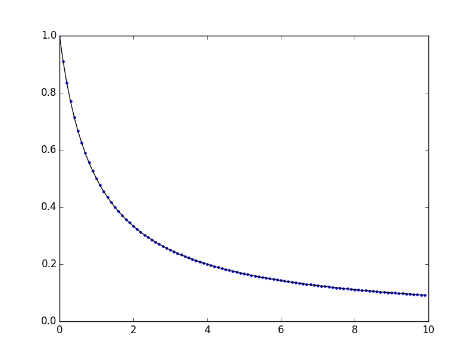

# Volterra Equation Solver
This implements two methods for solving Volterra integral equations of the first kind,


These are integral equations for the function `f` where `g` and `K` are known functions.  Note the  `t` in the integration bounds.  The factor `(t-s)^{-\mu}` accounts for any singularities in the kernel `K`.  In other words, if you have an integral equation such that `K(t,t)` is unbounded (singular) and `K(t,s)` diverges like `(t-s)^{-\mu}` as `t->s`, rewrite it in the form above (so that `K` is well-behaved part of the origial kernel).

# Example
The integral equation (taken from P. Linz, [Analytical and Numerical Methods for Volterra Equations][1])


has the exact solution


```python
>>> import volterra
>>> def g(t):
...   return 2*t*np.arctanh(np.sqrt(t/(t+1))) / np.sqrt(t+1) + 2*np.sqrt(t)
...
>>> def K(t,s):
...     return 1 + t + s
...
>>> dt = 0.1
>>> t = np.arange(0.0, 100*dt, dt)
>>> F = volterra.block(K, g, dt, 100, mu=0.5)
>>> np.allclose(F, 1/(1+t), atol=1e-2, rtol=0.0)
True
>>> plot(t, F, '.')
>>> plot(t, 1/(1+t), 'k-')
```

[1]: http://epubs.siam.org/doi/book/10.1137/1.9781611970852

# Issues
* At the moment, the solvers only work for `mu=0.5`, but fixing this should be easy (I already have the needed formulas and it's just a matter of typing them out in Python)
* The block method needs a value for `f(0)` in order to start.  You can supply a value with the optional argument `F0`.  If you don't provided a value, `block` will attempt to find a value, however it may choose poorly so beware!
